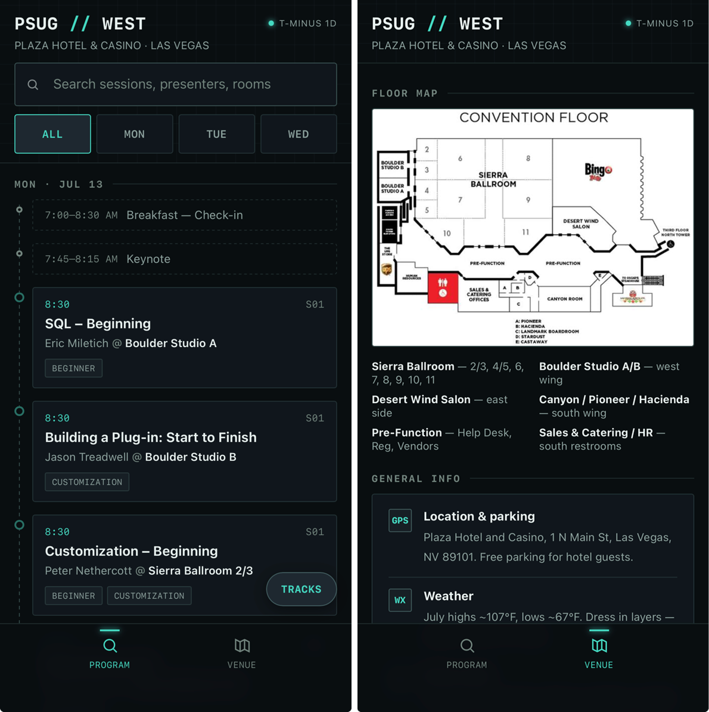

# PSUG West Companion

Hotel wifi at conferences is always spotty, and I wanted the session schedule
and floor map on my phone without needing signal. So I built this with
Claude: one HTML file, works fully offline, no app or account needed.

Not an official PSUG or PowerSchool tool — just something I made for myself
that other attendees might find useful too.

Schedule data current as of Jul 11, 2026.

## What's in it

- **Program** — every session, all three days, all rooms. Searchable, filterable by track.
- **Venue** — floor map, room legend, parking/weather/dress code, test server login.

This is the shared version — it has the public conference schedule, not
anyone's personal "my sessions" list.

## How to use it

There are two ways to get this on your phone. Both end up fully offline —
they just differ in how you get there.

### Option A — the hosted link (easiest)

**[jherrera-csmc.github.io/REPO-NAME](https://jherrera-csmc.github.io/REPO-NAME/)**
← update this link once GitHub Pages is live

1. Open that link in Safari (iPhone) or Chrome (Android) — needs a connection
   the first time, like any webpage.
2. Tap the share/menu icon → **Add to Home Screen** → **Add**.
3. From then on, open it from the home screen icon like any app. It'll keep
   working with **no signal at all**, even in a dead-zone hotel basement —
   the page caches itself on that first visit.

If you ever want to double check it's cached properly: open it once on wifi,
then turn on Airplane Mode and open it again from the home screen icon.

### Option B — download the file directly

For anyone who'd rather not visit a link at all, or wants a copy that never
touches the internet even once.

**iPhone:** Safari can't open local HTML files — that's an iOS limitation,
not this file. You need a local file viewer app; I used
**[Documents by Readdle](https://apps.apple.com/app/documents-by-readdle/id364901807)**
(free to start, paid tiers exist for extra features you don't need here), but
any app that opens local HTML works.

1. Download `index.html` (tap the file, save to your device).
2. Open it from inside your file viewer app's built-in browser.
3. Tap the **share icon** in the browser toolbar → **Add to Home Screen** →
   name it → **Add**.

**Android:** tap the downloaded file — your file manager or browser opens it
directly, no extra app needed.

**Desktop:** open the file in any browser.

## Want your own schedule in it?

This version doesn't have anyone's personal sessions. If you want your own
added:

1. Download your personal schedule as a PDF from the PSUG registration site.
2. Share that PDF with [Claude](https://claude.ai), along with `index.html`.
3. Ask Claude to add your sessions in.

Claude wrote the code, so it can edit it for you too — no coding needed on
your end.

## Notes

- Session times/rooms are as of when this was built — always double-check
  anything time-sensitive against the official conference app in case of
  last-minute changes.
- If you edit `index.html` later (new sessions, room changes, etc.), also
  bump the version string at the top of `service-worker.js`
  (`psug-west-v1` → `psug-west-v2`). Without that, phones that already
  installed the hosted version (Option A) will keep serving the old cached
  copy instead of picking up your changes.

## Just an experiment

This started as a quick experiment with Claude, not a polished engineering
project. Could I have coded this myself? Probably. Could the code be
structured better? Absolutely. But it took Claude about 10 minutes to whip up
a working prototype, and maybe another 10 minutes of revisions after that.
Setting up this repo took longer than writing the code did.

---

Conductor: **@jherrera-csmc** · Developer: **Claude**
